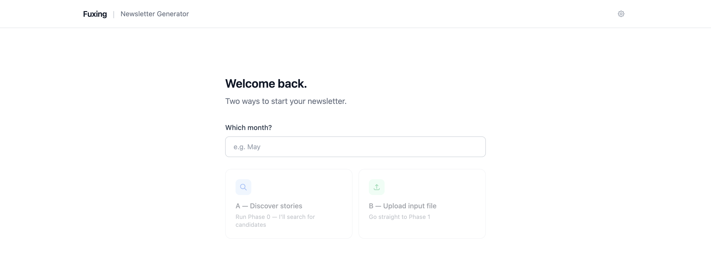

# Fuxing Newsletter Generator



An AI-assisted workflow that turns a list of article links into finished, Figma-ready cards for Cartier's monthly Fuxing newsletter.

---

## How it works

Each issue moves through four phases. Every phase begins only after you approve the previous output.

| Phase | You provide | You get |
|---|---|---|
| **0 — Discovery** | A month (or a list of topics) | Candidate stories + a ready-to-review input file |
| **1 — Newsletter** | The approved input file | Headlines, summaries, and categories for all 10 topics |
| **2 — Image prompts** | An art style (+ optional API key) | One image prompt per topic — images auto-generated if a key is given |
| **3 — Figma assembly** | The 10 images pasted onto the canvas | 10 exported `.png` cards |

---

## Where you come in

- **Start** — give a month for Phase 0, or drop in your own `input_data_[month].txt`.
- **Phase 1** — review and approve the headlines and summaries.
- **Phase 2** — name the art style; provide an API key to auto-generate, or drop images into `[month]/images/`.
- **Phase 3** — paste images onto the Figma canvas, swap fonts with the Font Switcher plugin, then export the 10 cards.

**Figma template:** [Newsletter_Template](https://www.figma.com/design/qwCKC7PIH7V2Kivhtn9OZW/Newsletter_Template?node-id=0-1&t=HB573EBttLRaWmvS-1) — all 5 card variants, background rectangle, and header/footer nodes.

---

## Input file format

Name it `input_data_[month].txt`:

```
Topic 1:
- https://...
- https://...
Narrative: Focus on the OpenAI vs Google dynamic.

Topic 2:
- https://...
No summary.
```

- `Topic N:` marks each story; multiple links are synthesized into one entry
- `Narrative:` optionally steers the angle
- `No summary.` produces a headline-only card

---

## Project files

```
CLAUDE.md               AI instructions (role, input format, workflow)
phase0–3_*.md           Detailed rules for each phase
reference_materials/    Published newsletters + card PNGs for style calibration
ui/index.html           Browser UI (shown above)
[Month]/                Per-issue outputs and generated images
```
